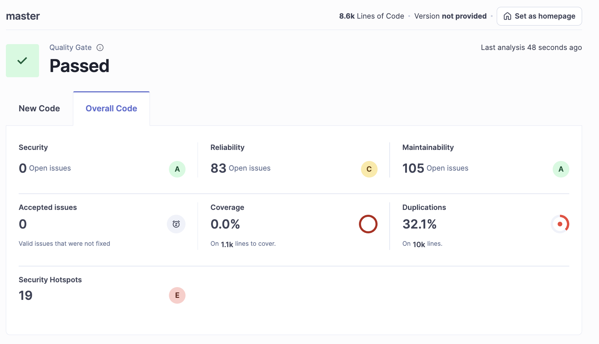
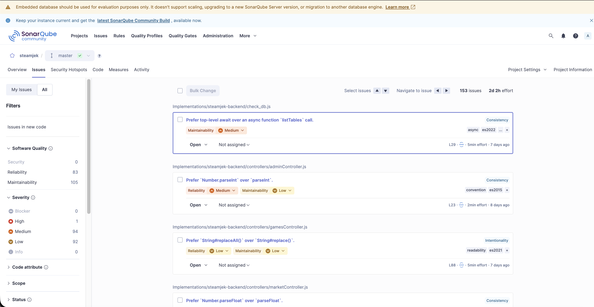

# Project Handover Report - MharRuengSang

## 1. Project Features
The project, "Steamjek," is a digital game distribution and marketplace platform. Based on the source code and frontend wireframes received, the system supports the following key features:
- **User Authentication & Profiles:** User registration and login with JWT-based security, and user profile management (`authController`, `page7_profile.html`).
- **Game Storefront:** Browsing the game catalog, searching, and viewing detailed game information (`gamesController`, `page1_store.html`, `page2_game_detail.html`).
- **Shopping Cart & Checkout:** Managing a cart of games and facilitating secure transactions using a Stripe integration (`cartController`, `purchasesController`, `page3_cart.html`).
- **User Library:** Viewing games a user has purchased and currently owns (`page6_library.html`).
- **Community Marketplace:** A secondary market allowing users to buy, sell, and trade in-game items (`marketController`, `page4_marketplace.html`).
- **Wishlisting:** Adding and removing games from a personal wishlist for future purchases (`wishlistController`, `page5_wishlist.html`).
- **Ratings & Reviews:** Allowing users to leave 1-5 star ratings and comments on games (`ratingsController`).
- **Admin Management:** Special administrative tools for overseeing and approving users, games, and marketplace activity (`adminController`).

## 2. Design Verification
*(Blank for now - C4 diagram updates and implementation consistency verification to be completed later)*

## 3. Reflections on Project Handover

### a. Technologies Used
- **Backend Infrastructure:** Node.js backend using the Express.js framework for RESTful API routing.
- **Database:** PostgreSQL used as the primary relational database, interfaced via `pg` (node-postgres) and pure SQL queries (`setup.sql`, `migrate_v2.sql`).
- **Frontend / Client:** Vanilla HTML, CSS, and JavaScript. It is wrapped as a desktop client using **Electron** (`electron .` setup).
- **Payments:** Stripe API for handling checkout and payments.
- **Security & Validation:** JSON Web Tokens (JWT) for route authorization and access control (e.g., `isAuth`, `isAdmin` middlewares).
- **Testing:** Evidence of test scripts in the `tests/` directory (likely Jest or Supertest) for testing backend endpoints.

### b. Required Information for a Successful Handover
To successfully receive and deploy this project without friction, the receiving team requires:
1. **Environment Variables:** A `.env.example` file that shows exactly all the necessary configuration keys (e.g. `DB_HOST`, `DB_PASSWORD`, `JWT_SECRET`, `STRIPE_SECRET_KEY`).
2. **Setup Instructions:** Step-by-step commands to install dependencies (`npm install`), boot the database schema (`node migrate.js`), and populate it with seed data (`node db_seed.js`).
3. **Execution Commands:** Clear instructions on how to start the independent backend server and the Electron-based frontend concurrently.
4. **Third-Party Services Context:** Stripe test accounts and test card details mapped to the `.env` provided in order to verify full business logic (checkout flows).
5. **System Architecture Document:** Up-to-date C4 Model or ERD (Entity Relationship Diagram) mapping out the domains (store vs. community market).

### c. Code Quality (SonarQube)

### d. Identified & Resolved Initialization Issues
During the initial setup and handover of this codebase, several configuration and database script bugs were identified and successfully fixed:
1. **Database SSL Connection Failure:** The `pg` pool connection in `db/index.js` was hardcoded to `ssl: { rejectUnauthorized: false }`, which caused connection errors for local servers that didn't support SSL.
    * *Resolution:* Made SSL conditional based on a `.env` variable (checking for `DB_SSL=true`).
2. **PostgreSQL Permissions Issues:** Application queries and migrations previously threw `error: permission denied for table games` and ownership errors because database tables were assigned to the local system user rather than the defined `postgres` role.
    * *Resolution:* Altered the schema, table, and sequence ownerships to explicitly belong to the `postgres` user using PostgreSQL administration scripts.
3. **Seeding Script Errors (`db_seed.js`):** The seed script couldn't execute cleanly due to parameter mismatch issues (asking for SQL bind parameters like `$6` or `$8` but providing too few values) and an outdated trailing foreign-key constraint (`market_listings_item_id_fkey`) colliding with the newer `item_type_id` schema migration.
    * *Resolution:* Corrected the query bind parameter indexes in the script and dropped the stale constraint on `market_listings` in the database, updating it to properly reference `item_types`. The migrations and seeders now execute without failing.
